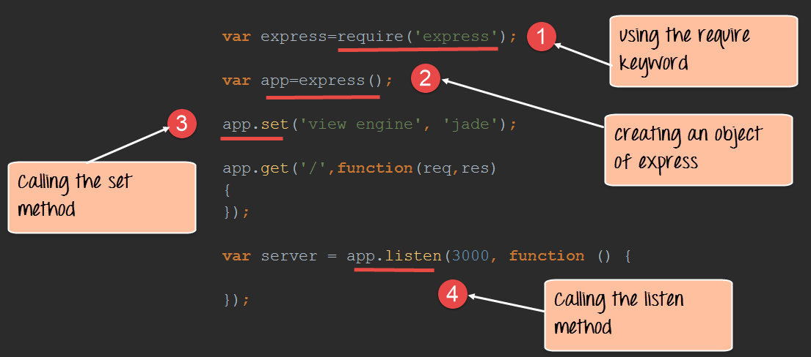
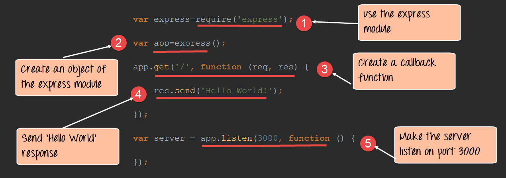

# Node.Js

## Introduction

The modern web application has really come a long way over the years with the introduction of many popular frameworks such as bootstrap, Angular JS, etc. All of these frameworks are based on the popular[ JavaScript ](https://www.guru99.com/interactive-javascript-tutorials.html)framework.

But when it came to developing server based applications there was just kind of a void, and this is where Node.js came into the picture.

Node.js is also based on the JavaScript framework, but it is used for developing server-based applications

## What is node.js?

Node.js is an open-source, cross-platform runtime environment used for development of server-side web applications. Node.js applications are written in JavaScript and can be run on a wide variety of operating systems.

Node.js is based on an event-driven architecture and a non-blocking Input/Output API that is designed to optimize an application's throughput and scalability for real-time web applications.

## Create a example webserver

1 - Create a file `webserver.js` with the following content

```javascript
var http = require('http');

http.createServer(function (req, res) {
    res.writeHead(200, {'Content-Type': 'text/html'});
    res.end('Hello World!');
    console.log("hellow");
}).listen(8080);
```

**Code Explanation:**

1. The basic functionality of the "require" function is that it reads a[ JavaScript ](https://www.guru99.com/interactive-javascript-tutorials.html)file, executes the file, and then proceeds to return an object. Using this object, one can then use the various functionalities available in the module called by the require function. So in our case, since we want to use the functionality of http and we are using the require(http) command.
2. In this 2nd line of code, we are creating a server application which is based on a simple function. This function is called, whenever a request is made to our server application.
3. When a request is received, we are asking our function to return a "Hello World" response to the client. The writeHead function is used to send header data to the client and while the end function will close the connection to the client.
4. We are then using the server.listen function to make our server application listen to client requests on port no 7000. You can specify any available port over here.

2 - Execute the code

```bash
> node webserver.js
```

3 - Output

In your browser go to `localhost:8080` and hit enter, you will see the message `hello world`

## What are modules in Node.js?

As stated earlier, modules in Node js are a way of encapsulating code in a separate logical unit. There are many readymade modules available in the market which can be used within Node js.

Below are some of the popular modules which are used in a Node js application

1. **Express framework** – Express is a minimal and flexible Node js web application framework that provides a robust set of features for the web and[ Mobile ](https://www.guru99.com/mobile-testing.html)applications.
2. **Socket.io** - Socket.IO enables real-time bidirectional event-based communication. This module is good for creation of chatting based applications.
3. **Jade** - Jade is a high-performance template engine and implemented with[ JavaScript ](https://www.guru99.com/interactive-javascript-tutorials.html)for node and browsers.
4. **MongoDB** - The[ MongoDB ](https://www.guru99.com/mongodb-tutorials.html)Node.js driver is the officially supported node.js driver for MongoDB.
5. **Restify** - restify is a lightweight framework, similar to express for building REST APIs
6. **Bluebird** - Bluebird is a fully featured promise library with focus on innovative features and performance

## Using modules in Node.js

*A prerequisite is to type the command `npm init` to create the `package.json` file*

In order to use modules in a Node.js application, they first need to be installed using the Node package manager.

The below command line shows how a module "express" can be installed.

```bash
> npm install express
```

- The above command will download the necessary files which contain the "express modules" and take care of the installation as well
- Once the module has been installed, in order to use a module in a Node.js application you need to use the 'require' keyword. This keyword is a way that Node.js uses to incorporate the functionality of a module in an application.

Let's look at an example how we can use the "require" keyword. The below code example shows how to use the require function



```javascript
var express=require('express');
var app=express();
app.set('view engine','jade');
app.get('/',function(req,res)
{
});
var server=app.listen(3000,function()
{
});
```

1. In the first statement itself, we are using the "require" keyword to include the express module. The "express" module is an optimized JavaScript library for Node.js development. This is one of the most commonly used Node.js modules.
2. After the module is included, in order to use the functionality within the module, an object needs to be created. Here an object of the express module is created.
3. Once the module is included using the "require" command and an "object" is created, the required methods of the express module can be invoked. Here we are using the set command to set the view engine, which is used to set the templating engine used in Node.js.
4. Here we are using the listen method to make the application listen on a particular port number.

### Creating NPM modules

Node.js has the ability to create custom modules and allows you to include those custom modules in your Node.js application.

Let's look at a simple example of how we can create our own module and include that module in our main application file. Our module will just do a simple task of adding 2 numbers.

Let's follow the below steps to see how we can create modules and include them in our application.

**Step 1)** Create a file called "Addition.js" and include the below code. This file will contain the logic for your module.

Below is the code which would go into this file;


```javascript
var exports=module.exports={};
exports.AddNumber=function(a,b)
{
return a+b;
};
```

1. The "exports" keyword is used to ensure that the functionality defined in this file can actually be accessed by other files.
2. We are then defining a function called 'AddNumber'. This function is defined to take 2 parameters, a and b. The function is added to the module "exports" to make the function as a public function that can be accessed by other application modules.
3. We are finally making our function return the added value of the parameters.

Now that we have created our custom module which has the functionality of adding 2 numbers. It's now time to create an application, which will call this module.

In the next step, we will actually see how to create the application which will call our custom module.

**Step 2)** Create a file called "app.js," which is your main application file and add the below code


```javascript
var Addition=require('./Addition.js');
console.log(Addition.AddNumber(1,2));
```

1. We are using the "require" keyword to include the functionality in the Addition.js file.
2. Since the functions in the Addition.js file are now accessible, we can now make a call to the AddNumber function. In the function, we are passing 2 numbers as parameters. We are then displaying the value in the console.


**Output**:

- When you run the app.js file, you will get an output of value 3 in the console log.
- The result is because the AddNumber function in the Addition.js file was called successfully and the returned value of 3 was displayed in the console.

### Extending modules

When creating modules, it is also possible to extend or inherit one module from another.

In modern day programming, it's quite common to build a library of common modules and then extend the functionality of these common modules if required.

Let's look at an example of how we can extend modules in Node.js.

**Step 1)** Create the base module.

In our example, create a file called "Tutorial.js" and place the below code.

In this code, we are just creating a function which returns a string to the console. The string returned is "Guru99 Tutorial".


```javascript
var exports=module.exports={};
exports.tutorial=function()
{
console.log("Guru99 Tutorial")
}
```

1. The exports module is used so that whatever function is defined in this file can be available in other modules in Node.js
2. We are creating a function called tutorial which can be used in other Node.js modules.
3. We are displaying a string "Guru99 Tutorial" in the console when this function is called.

Now that we have created our base module called Tutorial.js. It's now time to create another module which will extend this base module.

We will explore how to do this in the next step.

**Step 2)** Next we will create our extended module. Create a new file called "NodeTutorial.js" and place the below code in the file.


```javascript
var Tutor=require('./Tutorial.js');
exports.NodeTutorial=function()
{
console.log("Node Tutorial")
function pTutor()
{
var PTutor=Tutor
PTutor.tutorial();
}
}

Or

var Tutor=require('./Tutorial.js');
exports.NodeTutorial=function()
{
console.log("Node Tutorial")
this.pTutor = function ()
{
var PTutor=Tutor
PTutor.tutorial();
}
}
```

Note, the following key points about the above code

1. We are using the "require" function in the new module file itself. Since we are going to extend the existing module file "Tutorial.js", we need to first include it before extending it.
2. We then create a function called "Nodetutorial." This function will do 2 things,

- It will send a string "Node Tutorial" to the console.
- It will send the string "Guru99 Tutorial" from the base module "Tutorial.js" to our extended module "NodeTutorial.js".

1. Here we are carrying out the first step to send a string to "Node Tutorial" to the console.
2. The next step is to call the function from our Tutorial module, which will output the string "Guru99 Tutorial" to the console.log.

**Step 3)** Create your main app.js file which is your main application file and include the below code.


```javascript
var localTutor=require('./NodeTutorial.js');
localTutor.NodeTutorial();
localTutor.NodeTutorial.pTutor();

Or use this code

var tut = new localTutor.NodeTutorial();  // Create and save object
tut.pTutor();  // Call function on object
```

The above code does the following things;

1. Our main application file now calls the "NodeTutorial" module.
2. We are calling the "NodeTutorial" function. By calling this function, the text "Node Tutorial" will be displayed in the console log.
3. Since we have extended our Tutorial.js module and exposed a function called pTutor. It also calls the tutorial module in the Tutorial.js module, and the text "Guru99 Tutorial" will be displayed to the console as well.

**Output:**

Since we have executed the above app.js code using Node, we will get the following output in the console.log file

- Node Tutorial
- Guru99 Tutorial

## Managing third party packages with npm

As we have seen, the "Node package manager" has the ability to manage modules, which are required by Node.js applications.

Let's look at some of the functions available in the node package manager for managing modules

1 - Installing packages in global mode – Modules can be installed at the global level, which just basically means that these modules would be available for all Node.js projects on a local machine. The example below shows how to install the "express module" with the global option.

**npm install express –global**

The global option in the above statement is what allows the modules to be installed at a global level.

2 - Listing all of the global packages installed on a local machine. This can be done by executing the below command in the command prompt

**npm list --global**

Below is the output which will be shown, if you have previously installed the "express module" on your system.

Here you can see the different modules installed on the local machine.

3 - Installing a specific version of a package – Sometimes there may be a requirement to install just the specific version of a package. Once you know what is the package and the relevant version that needs to be installed, you can use the npm install command to install that specific version.

The example below shows how to install the module called underscore with a specific version of 1.7.0

npm install **underscore@1.7.0**

4 - Updating a package version – Sometimes you may have an older version of a package in a system, and you may want to update to the latest one available in the market. To do this one can use the npm update command. The example below shows how to update the underscore package to the latest version

**npm update underscore**

5 - Searching for a particular package – To search whether a particular version is available on the local system or not, you can use the search command of npm. The example below will check if the express module is installed on the local machine or not.

**npm search express**

6 - Un-installing a package – The same in which you can install a package, you can also un-install a package. The uninstallation of a package is done with the uninstallation command of npm. The example below shows how to uninstall the express module

**npm uninstall express**

## What is the package.json file

The "package.json" file is used to hold the **metadata about a particular project**. This information provides the Node package manager the necessary information to understand how the project should be handled along with its dependencies.

The package.json files contains information such as the project description, the version of the project in a particular distribution, license information, and configuration data.

The package.json file is normally located at the root directory of a Node.js project.


## Create HTTP Web Server in Node.js

The Node.js framework is mostly used to create server based applications. The framework can easily be used to create web servers which can serve content to users.

There are a variety of modules such as the "http" and "request" module, which helps in processing server related requests in the web server space. We will have a look at how we can create a basic web server application using Node js.

### Node as web server using HTTP

Let's look at an example of how to create and run our first Node js application.

Our application is going to create a simple server module which will listen on port no 7000. If a request is made through the browser on this port no, then server application will send a 'Hello' World' response to the client.


**Code Explanation:**

1. The basic functionality of the require function is that it reads a[ JavaScript ](https://www.guru99.com/interactive-javascript-tutorials.html)file, executes the file, and then proceeds to return the exports object. So in our case, since we want to use the functionality of the http module, we use the require function to get the required functions from the http module so that it can be used in our application.
2. In this line of code, we are creating a server application which is based on a simple function. This function is called whenever a request is made to our server application.
3. When a request is received, we are saying to send a response with a header type of '200.' This number is the normal response which is sent in an http header when a successful response is sent to the client.
4. In the response itself, we are sending the string 'Hello World.'
5. We are then using the server.listen function to make our server application listen to client requests on port no 7000. You can specify any available port over here.

If the command is executed successfully, the following Output will be shown when you run your code in the browser.

**Output:**


From the output

- You can clearly see that if we browse to the URL of localhost on port 7000, you will see the string 'Hello World' displayed in the page.
- Because in our code we have mentioned specifically for the server to listen on port no 7000, we are able to view the output when browsing to this url.

Here is the code

```javascript
var http=require('http')
var server=http.createServer((function(request,response)
{
	response.writeHead(200,
	{"Content-Type" : "text/plain"});
	response.end("Hello World\n");
}));
server.listen(7000);
```

## Handling GET Requests in Node.js

Making a GET Request to get the data from another site is relatively very simple in Node.js. To make a Get request in the node, we need to first have the request module installed. This can be done by executing the following line in the command line

**npm install request**

Now let's see the code which can make use of this 'request' command.


**Code Explanation:**

1. We are using the 'require' module which was installed in the last step. This module has the necessary functions which can be used to make GET requests to websites.
2. We are making a GET Request to www.google.com and subsequently calling a function when a response is received. When a response is received the parameters(error, response, and body) will have the following values
   1. Error – In case there is any error received when using the GET request, this will be recorded here.
   2. Response- The response will have the http headers which are sent back in the response.
   3. Body- The body will contain the entire content of the response sent by Google.
3. In this, we are just writing the content received in the body parameter to the console.log file. So basically, whatever we get by going to **www.google.com** will be written to the console.log.

Here is the code for your reference

```javascript
var request = require("request");
	request("http://www.google.com",function(error,response,body)
	{
		console.log(body);
	});
```

# Node.js Express FrameWork 

## What is Express.js?

Express.js is a Node js web application server framework, which is specifically designed for building single-page, multi-page, and hybrid web applications.

It has become the standard server framework for node.js. Express is the backend part of something known as the MEAN stack.

The MEAN is a free and open-source[ JavaScript ](https://www.guru99.com/interactive-javascript-tutorials.html)software stack for building dynamic web sites and web applications which has the following components;

**1) MongoDB** - The standard NoSQL database

**2) Express.js** - The default web applications framework

**3) Angular.js** - The JavaScript MVC framework used for web applications

**4) Node.js** - Framework used for scalable server-side and networking applications.

The Express.js framework makes it very easy to develop an application which can be used to handle multiple types of requests like the GET, PUT, and POST and DELETE requests

## Installing and using Express

Express gets installed via the Node Package manager. This can be done by executing the following line in the command line

**npm install express**

The above command requests the Node package manager to download the required express modules and install them accordingly.

Let's use our newly installed Express framework and create a simple "Hello World" application.

Our application is going to create a simple server module which will listen on port no 3000. In our example, if a request is made through the browser on this port no, then server application will send a 'Hello' World' response to the client.



```javascript
var express=require('express');
var app=express();
app.get('/',function(req,res)
{
res.send('Hello World!');
});
var server=app.listen(3000,function() {});
```

**Code Explanation:**

1. In our first line of code, we are using the require function to include the "express module."
2. Before we can start using the express module, we need to make an object of the express module.
3. Here we are creating a callback function. This function will be called whenever anybody browses to the root of our web application which is **http://localhost:3000** . The callback function will be used to send the string 'Hello World' to the web page.
4. In the callback function, we are sending the string "Hello World" back to the client. The 'res' parameter is used to send content back to the web page. This 'res' parameter is something that is provided by the 'request' module to enable one to send content back to the web page.
5. We are then using the listen to function to make our server application listen to client requests on port no 3000. You can specify any available port over here.3

If the command is executed successfully, the following Output will be shown when you run your code in the browser


## What are Routes?

Routing refers for determining the way in which an application responds to a client request to a particular endpoint.

For example, a client can make a GET, POST, PUT or DELETE http request for various URL's such as the one's shown below;

http://localhost:3000/Books

http://localhost:3000/Students

In the above example,

- If a GET request is made for the first URL, then the response should ideally be a list of books.
- If the GET request is made for the second URL, then the response should ideally be a list of Students.
- So based on the URL which is accessed, a different functionality on the web server will be invoked and accordingly the response will be sent to the client. This is the concept of routing.

Each route can have one or more handler functions, which are executed when the route is matched.

The general syntax for a route is shown below

```
app.METHOD(PATH, HANDLER)
```

Wherein,

1) app is an instance of the express module

2) METHOD is an HTTP request method (GET, POST, PUT or DELETE)

3) PATH is a path on the server.

4) HANDLER is the function executed when the route is matched.

Let's look at an example of how we can implement routes in express. Our example will create 3 routes as

1. A /Node route which will display the string "Tutorial on Node" if this route is accessed
2. A /Angular route which will display the string "Tutorial on Angular" if this route is accessed
3. A default route / which will display the string "Welcome to Guru99 Tutorials."

Our basic code will remain the same as previous examples. The below snippet is an add-on to show case how routing is implemented.


```javascript
var express = require('express');
var app = express();
app.route('/Node',get(function(req,res)
{
    res.send("Tutorial on Node");
});
post(function(req,res)
{
    res.send("Tutorial on Angular");
});
put(function(req,res)
{
    res.send('Welcome to Guru99 Tutorials');
}));
```

**Code Explanation:**

1. Here we are defining a route if the URL

    

   http://localhost:3000/Node

    

   is selected in the browser. To the route, we are attaching a callback function which will be called when we browse to the Node URL.

   The function has 2 parameters.

- The main parameter we will be using is the 'res' parameter which can be used to send information back to the client.
- The 'req' parameter has information about the request being made. Sometimes additional parameters could be sent as part of the request being made, and hence the 'req' parameter can be used to find the additional parameters being sent.

1. We are using the send function to send the string "Tutorial on Node" back to the client if the Node route is chosen.
2. Here we are defining a route if the URL **http://localhost:3000/Angular** is selected in the browser. To the route, we are attaching a callback function which will be called when we browse to the Angular URL.
3. We are using the send function to send the string "Tutorial on Angular" back to the client if the Angular route is chosen.
4. This is the default route which is chosen when one browses to the route of the application – **http://localhost:3000**. When the default route is chosen, the message "Welcome to Guru99 Tutorials" will be sent to the client.

# Node.js MongoDB Tutorial with Examples

Please see examples [here](https://www.guru99.com/node-js-mongodb.html)